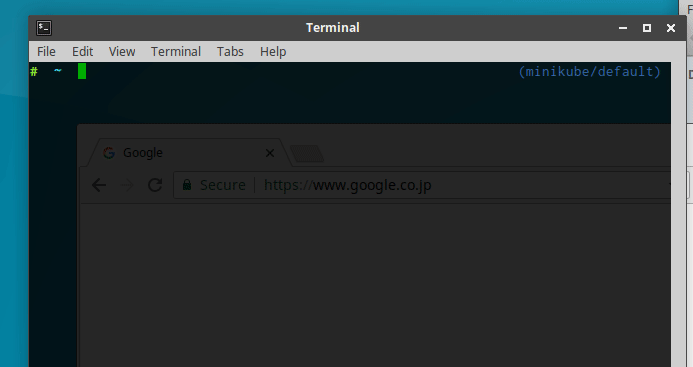

# kubectl open-svc SERVICE_NAME

This is a kubectl plugin that open the Kubernetes URL(s) for the specified service in your browser.



```
$ kubectl open-svc -h
Open the Kubernetes URL(s) for the specified service in your browser through a local proxy server using kubectl proxy.

Usage:
  kubectl open-svc SERVICE [--port=8001] [--address=127.0.0.1] [--keepalive=0] [flags]

Examples:
  # Open service/kubernetes-dashboard in namespace/kube-system
  kubectl plugin open-svc kubernetes-dashboard -n kube-system

Flags:
      --address string                   The IP address on which to serve on. (default "127.0.0.1")
      --alsologtostderr                  log to standard error as well as files
      --as string                        Username to impersonate for the operation
      --as-group stringArray             Group to impersonate for the operation, this flag can be repeated to specify multiple groups.
      --cache-dir string                 Default HTTP cache directory (default "/home/ksuda/.kube/http-cache")
      --certificate-authority string     Path to a cert file for the certificate authority
      --client-certificate string        Path to a client certificate file for TLS
      --client-key string                Path to a client key file for TLS
      --cluster string                   The name of the kubeconfig cluster to use
      --context string                   The name of the kubeconfig context to use
  -h, --help                             help for kubectl
      --insecure-skip-tls-verify         If true, the server's certificate will not be checked for validity. This will make your HTTPS connections insecure
      --keepalive duration               keepalive specifies the keep-alive period for an active network connection. Set to 0 to disable keepalive.
      --kubeconfig string                Path to the kubeconfig file to use for CLI requests.
      --log_backtrace_at traceLocation   when logging hits line file:N, emit a stack trace (default :0)
      --log_dir string                   If non-empty, write log files in this directory
      --logtostderr                      log to standard error instead of files (default true)
  -n, --namespace string                 If present, the namespace scope for this CLI request
  -p, --port int                         The port on which to run the proxy. Set to 0 to pick a random port. (default 8001)
      --request-timeout string           The length of time to wait before giving up on a single server request. Non-zero values should contain a corresponding time unit (e.g. 1s, 2m, 3h). A value of zero means don't timeout requests. (default "0")
  -s, --server string                    The address and port of the Kubernetes API server
      --stderrthreshold severity         logs at or above this threshold go to stderr (default 2)
      --token string                     Bearer token for authentication to the API server
      --user string                      The name of the kubeconfig user to use
  -v, --v Level                          log level for V logs
      --vmodule moduleSpec               comma-separated list of pattern=N settings for file-filtered logging
```

## Install the plugin

<!-- Krew does not support kubectl 1.12 plugin model yet. See https://github.com/GoogleContainerTools/krew/issues/33

You can install this plugin with [krew](https://github.com/GoogleContainerTools/krew) that is package manager for kubectl plugins.
```
$ kubectl plugin install open-svc
```
-->

If you are on macOS, you can install with homebrew:
```
$ brew tap superbrothers/kubectl-open-svc-plugin
$ brew install kubectl-open-svc-plugin
```

If you are on Linux, you can install with the following steps:
```
$ curl -sL -o open-svc.zip https://github.com/superbrothers/kubectl-open-svc-plugin/releases/download/$(curl -sL https://raw.githubusercontent.com/superbrothers/kubectl-open-svc-plugin/master/version.txt)/open-svc-$(uname | tr '[:upper:]' '[:lower:]')-amd64.zip
$ unzip open-svc.zip -d /tmp
$ mv /tmp/kubectl-open-svc /usr/local/bin/
```

## License

This software is released under the MIT License.
