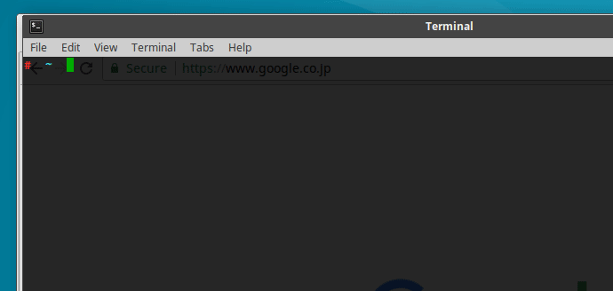

# kubectl plugin service SERVICE_NAME

This is a kubectl plugin that open the Kubernetes URL(s) for the specified service in your browser.



```
$ kubectl plugin service -h
Open the Kubernetes URL(s) for the specified service in your browser through a local proxy server using kubectl proxy.

Examples:
  # Open service/kubernetes-dashboard in kube-system namespace.
  kubectl plugin service kubernetes-dashboard -n kube-system

Usage:
  kubectl plugin service [flags] [options]

Use "kubectl options" for a list of global command-line options (applies to all commands).
```

## Install the plugin

If you are on macOS, you can install with homebrew:
```
$ brew tap superbrothers/kubectl-service-plugin
$ brew install kubectl-service-plugin
```

If you are on Linux, you can install with the following steps:
```
$ curl -sL -o service.zip https://github.com/superbrothers/kubectl-service-plugin/releases/download/$(curl -sL https://raw.githubusercontent.com/superbrothers/kubectl-service-plugin/master/version.txt)/service-$(uname | tr '[:upper:]' '[:lower:]')-amd64.zip
$ mkdir -p ~/.kube/plugins/service
$ unzip service.zip -d ~/.kube/plugins/service
```
## License

This software is released under the MIT License.
