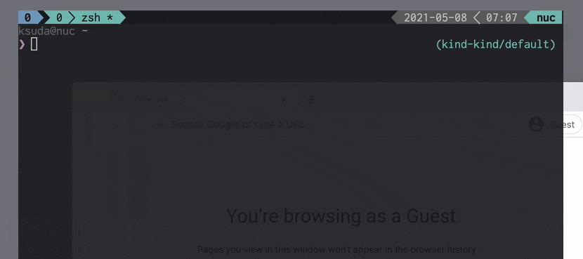

# kubectl open-svc SERVICE_NAME

This is a kubectl plugin that open the Kubernetes URL(s) for the specified service in your browser. Unlike the `kubectl port-forward` command, this plugin makes services accessible via their ClusterIP.



```
$ kubectl open-svc -h
Open the Kubernetes URL(s) for the specified service in your browser through a local proxy server.

Usage:
  kubectl open-svc SERVICE [--port=8001] [--address=127.0.0.1] [--keepalive=0] [flags]

Examples:
  # Open service/kubernetes-dashboard in namespace/kube-system
  kubectl open-svc kubernetes-dashboard -n kube-system

  # Open port "http-monitoring" of service/istiod in namespace/istio-system
  kubectl open-svc istiod -n istio-system --svc-port http-monitoring

  # Open port 15014 of service/istiod in namespace/istio-system
  kubectl open-svc istiod -n istio-system --svc-port 15014

  # Use "https" scheme with --scheme option for connections between the apiserver
  # and service/rook-ceph-mgr-dashboard in namespace/rook-ceph
  kubectl open-svc rook-ceph-mgr-dashboard -n rook-ceph --scheme https
```

## Install the plugin

1. Install [krew](https://github.com/GoogleContainerTools/krew) that is a plugin manager for kubectl
2. Run:

        kubectl krew install open-svc

3. Try it out

        kubectl open-svc -h

## License

This software is released under the MIT License.
